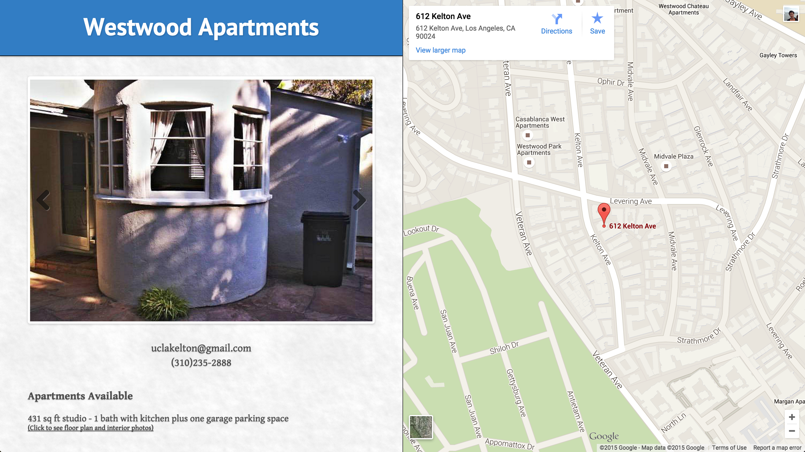

# [Westwood For Lease](http://westwood4lease.com/)

Westwood For Lease is the online website for a few apartment home offerings in Westwood, CA. The site is organized as a Jekyll installation even though it is a single page website in order to take advantage of the great free hosting solution offered by Github Pages, and because Jekyll Fluid tag is needed to render the current year.


* **Media Rich:** Multiple image galleries of different layouts are included in the site, allowing visitors to have an accurate and attractive representation of the property. The embedded map inserted at the top of the page elucidates to the visitor the exact location of the apartments offered on Kelton Ave.
* **Live Vacancy Status:** Each property listing has its respective availability status labelled on the site. This allows for visitors to quickly determine the availability of each apartment unit (because it says it right there!) and makes it very simple for management to set the appropriate vacancy status at the time of changing.
* **Fully Responsive:** This website is optimized for all screen sizes, and sizes comfortably no matter whether the site is being visited from a mobile device or a 22-inch display monitor.

## Style Developement

The [SASS](http://sass-lang.com/) structuring is set up separate from the Jekyll's built-in SASS compiling. So to develop styles for the site, navigate to the root directory of the project in Terminal and run (make sure [Compass](http://compass-style.org/) is installed:

```
compass watch
```

## Changing Unit Vacancy Status

Changing the availabilty status of a particular unit is easy. Just comment out the line:
```html
<span class="unavailable">Unavailable through July 2016</span>
```
and un-comment out the line:
```html
<!-- <span>Available starting July 2016</span> -->
```
And change the label text as needed. By toggling these lines of HTML on and off, the unit labels can be set to 'available' and 'unavailable' very quickly.

## Repo Notes

This repo exists as practice for developing a product from start to finish in a professional manner without cutting any corners from the HTML semantics, to the CSS syntax, to the file structure, to the repo documentation. The specs designs (Sketch 3 file) are also included in the repo for cohesiveness.

## License

Westwood For Lease is [MIT licensed](./LICENSE?raw=true) and is available for public use by any imaginary person who, for whatever ridiculous reason, ever wants to use this repo for their own work.

## Past Version Screenshots

**Version 1.0** (2014)

